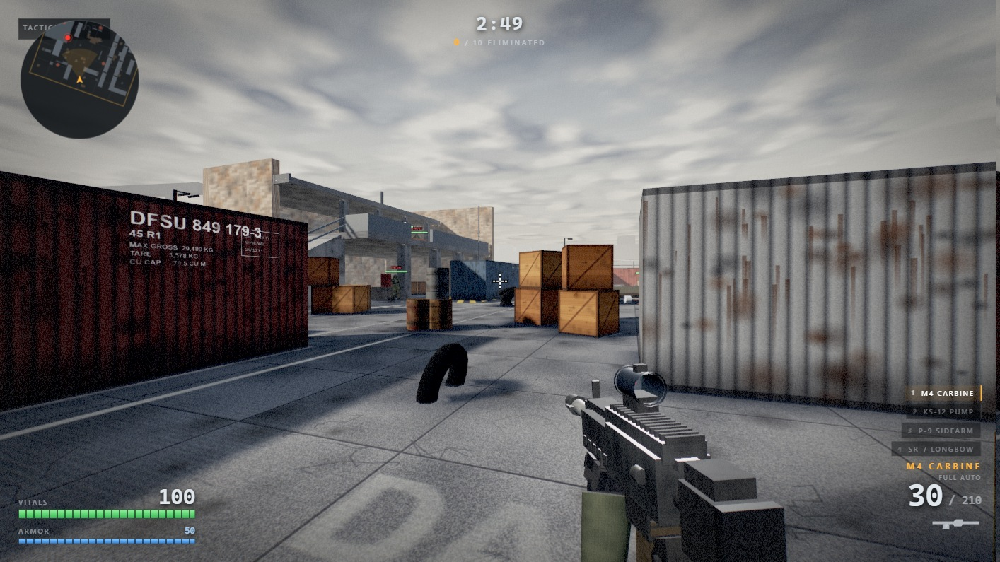
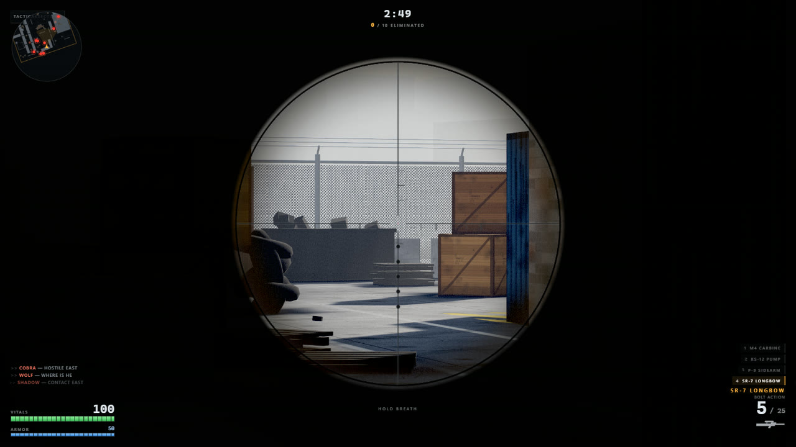
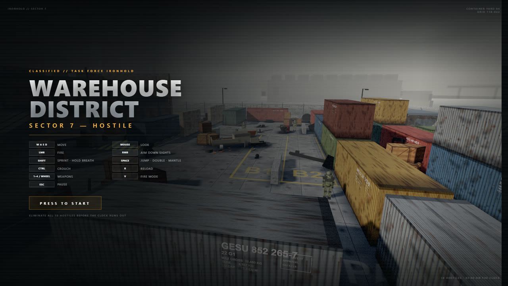

# Operation Ironhold

A complete first-person shooter that runs in a browser tab. One HTML file, no build step,
no package manager, and not a single image, audio or model file on disk.

**[Play it here](https://starknightt.github.io/operation-ironhold/)**



Ten hostiles hold a container yard in Sector 7. You have three minutes to clear it.

The entire game — renderer setup, world generation, weapon handling, enemy AI, audio
synthesis, post-processing and HUD — is about 6,300 lines of JavaScript and CSS inlined
into a single 290 KB `index.html`. The only external resource is three.js r128, pulled
from a CDN. Everything else is generated at runtime.

It was built by an AI agent across about thirty-six hours from twelve prompts. Every one of
them is recorded verbatim in [PROMPTS.md](PROMPTS.md).

## Running it

Open `index.html` in any desktop browser. That is the whole installation process.

If you would rather serve it:

```bash
python -m http.server 8123
```

Then visit `http://127.0.0.1:8123/index.html`.

Click the page to start. The click is what grants pointer lock, so the game cannot capture
your mouse until you ask it to. Press `Esc` to release the pointer and pause, then click
the overlay to resume.

Requires a desktop browser with WebGL and Pointer Lock. There is no touch input, so it
will not play on a phone.

## Controls

| Input | Action |
| --- | --- |
| `W` `A` `S` `D` | Move |
| Mouse | Look |
| Left click | Fire |
| Right click | Toggle aim down sights |
| `R` | Reload |
| `Shift` | Sprint, or hold breath while scoped |
| `Ctrl` | Crouch |
| `Space` | Jump; tap again in the air to double jump; hold near a ledge to mantle |
| `1` `2` `3` `4` | M4 carbine / KS-12 pump / P-9 sidearm / SR-7 Longbow |
| `V` | Toggle the rifle between full auto and semi |
| Mouse wheel | Cycle weapons |
| `Esc` | Pause |

## The round

Eliminate all ten hostiles inside 3:00. You start with 100 health and 50 armor, where armor
absorbs half of incoming damage until it is gone.

Hostiles hold fire for the first three seconds so you can get your bearings, and a combat
director caps the number shooting at you at any one moment to two. The rest keep
manoeuvring. That single constraint is what keeps a firefight readable instead of
collapsing into crossfire you cannot answer.

Dying or running out the clock ends the round. The report screen shows eliminations,
headshots, accuracy and time survived.

## Weapons

| Slot | Weapon | Magazine | Reserve | Behaviour |
| --- | --- | --- | --- | --- |
| 1 | M4 Carbine | 30 | 210 | 760 rpm full auto, `V` switches to semi |
| 2 | KS-12 Pump | 8 | 48 | Nine pellets per shell, pump between shots |
| 3 | P-9 Sidearm | 15 | 90 | 430 rpm semi automatic, fastest draw |
| 4 | SR-7 Longbow | 5 | 25 | Bolt action, a body hit kills |

Each carries a viewmodel built from primitives with gloved hands, sways against mouse
movement, bobs in time with footsteps, dips off screen to reload and ejects brass that
bounces off the concrete. Muzzle flash is a sprite backed by a real point light that the
bloom pass picks up. The rifle climbs on a fixed recoil pattern rather than random scatter,
so the spray is something you can learn to hold down.

## Aiming



Right click toggles ADS. Every weapon takes exactly 0.2s to settle in or out, tightens its
spread, and costs 40% of your movement speed while held.

| Weapon | FOV | Sight |
| --- | --- | --- |
| M4 Carbine | 75 to 55 | Red dot through an open tube |
| KS-12 Pump | 75 to 60 | Bead raised clear of the heat shield |
| P-9 Sidearm | 75 to 50 | Three-dot irons with an open notch |
| SR-7 Longbow | 75 to 15 | Scope overlay, mil-dot reticle |

The sniper is the one that changes the screen. Scoping swaps the crosshair for a full
overlay and hides the weapon behind the glass, which the composite shader veils the way
real optics do. The view drifts on a slow two-sine sway; holding `Shift` steadies it for
three seconds, after which you have to release and take another breath. Mouse sensitivity
scales with the zoom so your aim stays consistent on screen. The bolt takes 1.5s to work,
which makes a miss genuinely expensive.

## Movement

Container tops, crates, barrel stacks, the wrecked flatbed and every other solid prop are
walkable. A jump clears roughly 1.2m and the double jump adds another 0.9m. Holding `Space`
while airborne near a ledge up to about 1.95m above your feet pulls you up over it, which is
what gets you onto a container roof from flat ground and onto the sniper deck without the
ramp.

## Enemies

Ten soldiers patrol waypoints, routing around cover with a grid pathfinder over the same
colliders the player obeys. Spotting you takes a human 300 to 800ms before they react, and
they call it over the radio when they do.

In a fight they break for cover, strafe, flank, reload, and refuse to fire when their muzzle
is blocked even if they can see you over it. Line of sight is traced from the player's end
as well as theirs, which guarantees the two agree: if you cannot shoot them, they cannot
shoot you. Headshots do double damage, hits produce a flinch, and death drops them in a
ragdoll fall with the weapon coming loose.

## Everything is generated at runtime

There are no image, audio or model files anywhere in this repository.

Concrete, corrugated steel, plywood, rust, brick and chain link are painted into canvases at
load, down to the stencilled shipping marks on the container flanks. Weapons, hands and
soldiers are assembled from boxes, cylinders and spheres. The sky is a procedural dome with
an industrial skyline on the horizon.

Every sound is synthesised through the Web Audio API: per-weapon gunshots layered from a
crack, a body and a chest thump, reloads, footsteps, impact sounds that differ between wall
and flesh, the low-health heartbeat, and an ambient industrial hum with distant metal creaks
on a random timer. There is a convolution reverb built from a generated impulse response.



## Performance

Dynamic resolution scaling watches frame times and adjusts render scale to hold the target
frame rate. Repeated props are drawn with `InstancedMesh` grouped by colour. Static scenery
is merged into single draw calls. Tracers, decals, shell casings and particles are pooled.
Shadow casting is trimmed by bounding-box size, which cut roughly two thirds of the shadow
pass for objects that only ever contributed a sub-pixel smudge.

## Implementation notes

Five things are worth knowing before modifying `index.html`.

**No environment map.** three.js renders a metal with nothing to reflect as near-black, so
every material stays close to dielectric (`metalness` under about 0.2) and fakes metal
through colour and roughness instead. Raising `metalness` on the containers or weapons will
make any surface turned away from the sun collapse to black.

**Colour space is handled manually.** The renderer stays in linear output and the composite
shader does its own gamma encode, so material colours are pushed through
`convertSRGBToLinear()` at startup by `linearizeMats()`. New materials need the same
treatment or they will read oversaturated.

**Post-processing is hand-rolled.** The r128 CDN build has no `EffectComposer`, so bloom,
chromatic aberration, vignette, colour grading, damage tint and the low-health pulse all
live in one composite pass over a pair of render targets. Shadow tinting there is
multiplicative on purpose; an additive lift in linear space swamps near-black pixels and
turns the whole frame blue.

**Sight alignment is data, not guesswork.** Each viewmodel returns an `adsPos` that puts its
sight on the viewmodel camera's -Z axis: `x` is zero and `y` is the negative of the sight's
height in model space. Move a sight and that number has to move with it. Optics you look
*through* need open-ended geometry with a double-sided material, since a capped cylinder
renders as a solid disc.

**The viewmodel is deliberately telephoto.** `VM_FOV` is 41.9 against the world's 75, and
every weapon sits proportionally further from the eye to hold its screen size. The two
numbers are a pair: narrowing the lens without pushing the gun out shrinks it, and pushing
it out without narrowing the lens makes it tiny. What the pairing buys is a flatter depth
gradient, so the buttstock stops ballooning over the receiver. `adsRef` is the sight's
distance from the eye and feeds the ADS dolly, so it scales with `adsPos.z`; `adsPos.x` and
`.y` do not, because sight alignment is independent of range.

Two smaller conventions: walkable surfaces are opt-out, since `box()` pushes anything solid
into `groundMesh` and `groundAt()` only considers surfaces at or below the probe height. And
the crosshair is drawn to a canvas rather than built from HTML elements, because at two
pixels thick every edge has to land on a whole device pixel or it smears.

## Repository layout

```
index.html              the entire game
PROMPTS.md              every prompt that produced it, verbatim
screenshots/            images used by this README
tools/test-harness.js   collision, weapon and AI test suite
tools/autoplay-bot.js   pathfinding bot for unattended regression runs
```

The two files in `tools/` are development-only. Neither is referenced by `index.html`; they
are pasted into the console or injected over the DevTools protocol. The harness exposes
collision audits, weapon accuracy and hit-fidelity tests, map boundary probes and an enemy
watchdog. The bot plays full rounds on its own with configurable aim error and reaction
delay, which is how the collision and AI fixes were regression tested.

## License

MIT. See [LICENSE](LICENSE).
